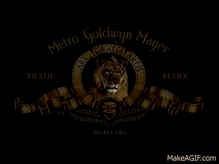
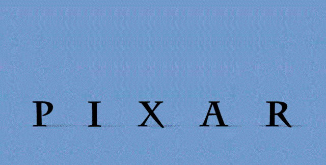
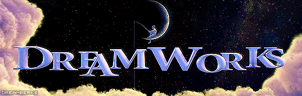
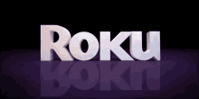
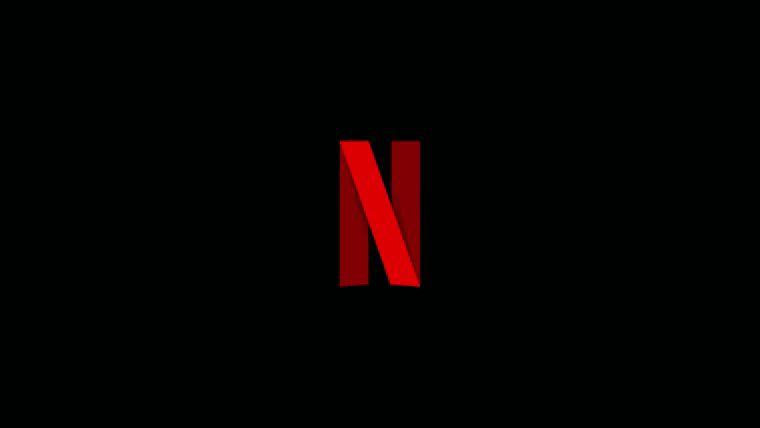
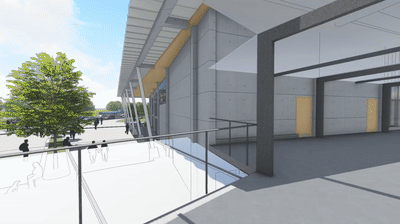

# Atividade Unidade I - Logotipo Animado (pontuada)

## Objetivos:

1. Consolidar os temas relacionados a montagem de cenários 3D e o controle do processo de formação de imagem nesse contexto;
2. Explorar transformações geométricas mais complexas, envolvendo deformação dos objetos e sua implentação em GPU, através de *shaders*;
3. Reforçar a compreensão dos parâmetros que definem e controlam uma camera virtual;
4. Entender o conceito de *viewport* e sua aplicação prática; 
5. Revisitar, em uma aplicação prática, o processo de modelagem de curvas paramétricas.
 
## Motivação:

Em TV e cinema é comum que estúdios e produtoras criem identidades visuais através de pequenos filmes de curta metragem. Chamados de [*production logo*](https://en.wikipedia.org/wiki/Production_logo),  apresentam em geal o logotipo da empresa com algum movimento ou personagem característico. Na Figura 1 vemos 4 dessas identidades visuais clássicas do cinema.

  

  

*Figura 1 - Production Logos clássicos: : o leão da MGM, o Luxo Jr. "amassando" o "I" da Pixar, o pescador na lua da DreamWorks e o castelo da Disney.* 

Essa mesma estratégia é hoje utilizada durante o período de carregamento de aplicativos, desde o sistema operacional do celular até dispositivos de *streamming* de vídeo como o *Roku* e aplicações como o *Netflix*, mostrados na Figura 2.

  

*Figura 2 - Production Logos utilizados em dispositivos e aplicativos.* 

Por se tratarem de pequenas animações, é comum que os elementos básicos desses *production logos* tenham relação direta com os nomes das produtoras ou estúdios de cinema. 

## A Atividade:

Você foi contratado para desenvolver a animação de um *production logo* de uma produtora de conteúdo, que deseja colocá-lo como parte de sua página na *Web*. O pessoal de criação já tem algumas idéias do que precisa, e apresentou os seguintes requisitos:

1. A animação deve ser leve e rápida para carregar e executar na página;

2. A marca da produtora é formada apenas por seu nome[^1], sem elementos gráficos adicionais; 

3. As letras que formam o nome da marca deve ter a mesma identidade visual (tipo de fonte), mas podem variar em material (cor);

4. O *production logo* deve possuir 2 níveis de animação: um movimento em bloco e movimentos específicos de cada um de seus elementos (letras);

5. As letras devem ter formas dinâmicas, como se feitas de material flexivel. Para isso sugeriram a aplicação de deformações do tipo *Twist*, *Bend* e *Tappering* [1], que eles já utilizam no [*Blender*](https://www.youtube.com/watch?v=Bkwm-DGMRuQ). Para garantir o desempenho da página essas transformações devem ser realizadas na **GPU**.

6. O posicionamento da camera é fixo e deve permitir ver a animação de forma centralizada e completa (sem cortes).

Além dessa animação dos elementos do *production logo*, o setor de criação quer uma segunda versão, onde a camera se mova ao longo do cenário, simulando um sobrevoo (*flythrough*), como os exemplos da Figura 3. Os requisitos para essa segunda animação são:

1. O movimento da camera deve ser suave e permitir que o *production logo* seja observado de pelo menos 3 pontos de vista distintos ao longo da trajetória;

2. A trajetória da camera deve ser definida por pontos de controle que possam depois ser modificados pelos profissionais de criação;

3. Para uma analise mais precisa, a visualização dessa animação deve permitir que a equipe de criação veja a animação do ponto de vista da camera e de um ponto de vista externo, que permita acompanhar o caminho da camera pelo cenário. As duas animações devem aparecer de forma simultanea na tela, mas ocupando áreas distintas, como uma visualização [*Picture-in-Picture (PIP)*](https://media.idownloadblog.com/wp-content/uploads/2023/05/Picture-in-Picture-Apple-TV-1536x938.jpg). 

   

*Figura 3 - Exemplos de sobrevoo de camera. Repare que a camera se movimenta ao longo de uma trajetória, mas também muda sua direção para apontar para um ponto de interesse específico.* 

**Dicas**: 

- O *Three.JS* [4] fornece suporte para a criação de modelos geométricos a partir de [fontes de letras](https://threejs.org/examples/?q=font#webgl_geometry_text). 

- O *Three.JS* [4] fornece suporte para a criação de [curvas paramétricas](https://threejs.org/examples/?q=curve#webgl_geometry_spline_editor) no espaço 3D [3].

## Entrega e Critérios de Avaliação:

O trabalho será submetido individualmente através do repositório disponibilizado pelo professor, via *GitHub Classroom*, para essa atividade. 

> **Não serão consideradas versões enviadas por e-mail, Google Classroom, Discord, ou outros meios.**

O trabalho será avaliado a partir dos seguintes critérios:

| Critério | Pontuação |
| :--- | :---: |
| 1. Relatório (README) | 0,5 |
| 2. Cenário Dinâmico |  |
| 	Criação do cenário com o *production logo* | 0,5 |
| 	Posicionamento adequado da camera | 0,5 |
| 	Movimento do *production logo* | 1,0 |
| 	Movimento dos elementos do *production logo* | 1,0 |
| 	Deformação dos elementos do *production logo* | 1,5 |
| 3. Câmera dinâmica |  |
| 	Criação da curva de movimento da câmera | 1,0 |
| 	Movimento de câmera passando pelos 3 pontos de vista | 2,0 |
| 	Visualização do movimento da câmera do ponto de vista externo | 1,5 |
| 	Visualização PIP | 0,5 |

Espera-se no relatório uma breve descrição de como sua solução foi construída, ressaltando aspectos da teoria de CG[2]. O relatório deve ser escrito utilizando a linguagem *markdown* [5] e **substituir o README original do repositório**. 

## Penalidades:              

> Submissões feitas após o prazo limite serão penalizadas em 1,0 ponto por dia de atraso.
> 
> Não haverá ressubmissão para códigos com erros de configuração de *paths*, falta de componentes, modelos ou qualquer elemento que "quebre" o código e impeça a correção. Fique atento e teste bem seu código antes do envio!
> 
>> **Em casos de plágio (total ou parcial) todos os envolvidos terão suas notas zeradas**. 

## Observações importantes:              

> Não presuma nada! Em caso de dúvida pergunte ao professor. 
> 
> Perguntas e dúvidas **gerais** devem ser postadas no canal do *Discord* específico. 
>
> **Dúvidas específicas** envolvendo seu código ou sua solução devem ser enviadas pelo *Discord* como mensagens privadas. 
>
> Mantenha sempre seu repositório atualizado para que o professor e o monitor da disciplina possam ter acesso ao código e ajuda-lo nas suas dúvidas.  

## Referências: 

[1]		Barr, A. H. (1984). **Global and local deformations of solid primitives**. ACM Siggraph Computer Graphics, 18(3), 21-30. disponível em: https://dl.acm.org/doi/pdf/10.1145/964965.808573.

[2] 	MARSCHNER, Steve; SHIRLEY, Peter. "**Fundamentals of Computer Graphics**". 5th Edition CRC Press, 2021.

[3]		Dirksen, J., **Learn Three.JS: Program 3D animations and visualizations for the web with JavaScript and WebGL**. 4th Edition, Packt Publishing, 2023.

[4]		**Three.JS**. https://threejs.org/docs/index.html.

[5]  Markdown Cheat Sheet. **A quick reference to the Markdown syntax**. disponível em: https://www.markdownguide.org/cheat-sheet/ 

[^1]: Use o nome que achar mais apropriado para a produtora. Pelo menos 5 letras! 
