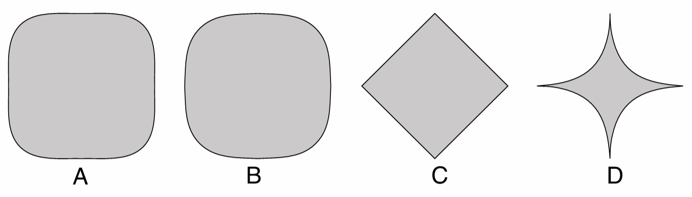

# Lab 01 - Hello World, Three.JS

## Objetivos:

1. Compreender a estrutura básica de integração *html/javascript/Three.JS*;
2. Entender as formas básicas de interação de uma aplicação gráfica em *Three.JS*: eventos *javascript* ou GUI;
3. Utilizar primitivas gráficas simples e pré-codificadas bem como controlar seus atributos.

## Exercícios:

Nessa complementação do Lab01 voce deve se basear nos códigos do fonte do Lab01 e criar novos códigos nesse novo repositório. Siga o padrão do Lab01 e coloque seus códigos html/javascript no diretorio `CodigoFonte`. 

1. Modifique o exemplo "*Animação*" para que a mudança de cores ocorra de uma forma mais suave ao passar de uma cor para a outra. 

1. Pesquise na documentação do *Three.JS* que outros tipos de primitiva *line* existem e modifique o exemplo "*primitivas2D*" para que esses outro tipos possam ser selecionados. Modifique a GUI para que a seleção dos tipos de linha pode ser feita de forma adequada.

1. Procure quais mecanismos o *Three.JS* oferece para controlar a aparência de linhas e codifique uma nova versão do exemplo "*primitivas2D*" em que se possa mudar a aparência de linhas. 

1. Ainda com base no código "*primitivas2D*" modifique-o para que desenhe uma forma geométrica mais complexa, como uma **elipses** ou sua generalização: as [**super elipses**](https://en.wikipedia.org/wiki/Superellipse). Na figura abaixo vemos os diversos formatos que uma *super elipse* pode assumir, de acordo com seus parametros: `n`, `a` e `b`. Sua nova aplicação deve permitir a visualização da *super elipse* bem como controlar, via GUI, os seus parâmetros. 

5. Acrescente ao código exemplo "*Primitivas3D*" pelo menos mais 3 objetos 3D dos rol de objetos disponíveis no *Three.JS*.

6. Assim como as linhas, objetos 3D também podem ter sua aparência customizada. Pesquise algumas possbilidades de mudança na aparência e incorpore esses parâmetros na GUI do exercício anterior, de forma que, qualquer que seja o objeto 3D selecioando, sua aparência seja aquela que segue as especificações da GUI naquele momento. 

Dúvidas? Poste no *Discord* da disciplina, no canal de **dúvidas-prática**.

## Referências:

- https://threejs.org/docs/index.html

- https://www.npmjs.com/package/lil-gui

- https://en.wikipedia.org/wiki/Superellipse  

- Dirksen, J., **Learn Three.JS: Program 3D animations and visualizations for the web with JavaScript and WebGL**. 4th Edition, Packt Publishing, 2023.

