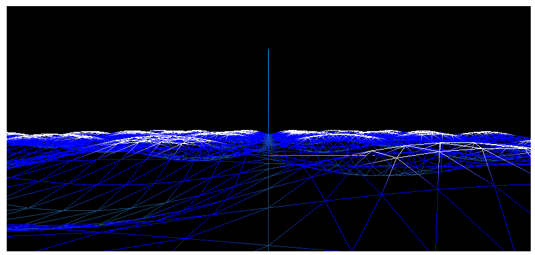
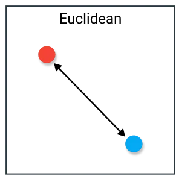
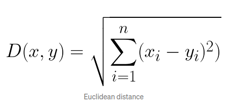
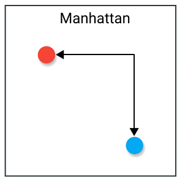
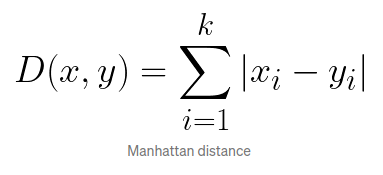
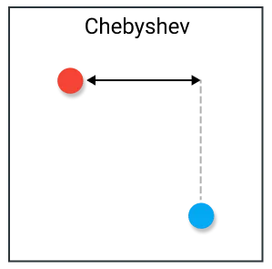
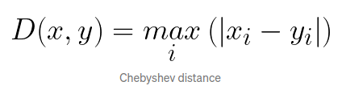
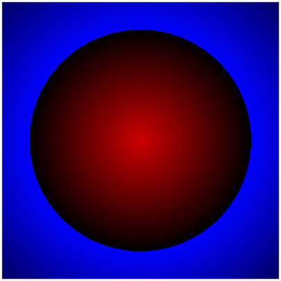
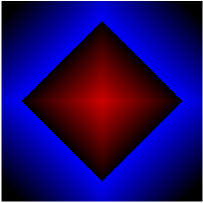
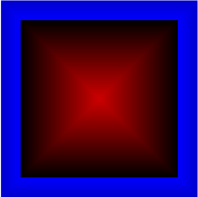

[](https://classroom.github.com/a/Xb1WvEN1)
# Lab02a - *Shaders* em *Three.js* - Exercícios

## Objetivos:

1. Compreender o que é um *shader* e seu papel dentro do *pipeline* gráfico;
2. Entender como se dá a integração de um *shader* dentro de uma aplicação gráfica em *Three.JS*;
3. Perceber as diferenças entre *vertex shader* e *fragment shader*, seus propósitos e parâmetros. 

## Exercícios:

1. Modifique o exemplo que utiliza o *Vertex Shader* para ter mais controles na definição da superfície, e obter uma animação que se pareça mais com a superfície do mar. Para isso ajuste os parâmetros da função trigonométrica, como a senoide: 
 ```y = Amplitude* sen(escala*ang + fase)*; ```
 
   Para controlar a amplitude, fase e escala de forma adequada a um movimento semelhante a ondas. 

2. Modifique também a coloração da simulação para que nas cristas das ondas a cor pareça espuma, e nos "vales" a cor se torne mais escura, como na figura a seguir.



3. Modifique o exemplo que utiliza o *fragment shader* para que as cores dos pixels seja definida a partir da distancia do pixel ao centro da imagem. Perceba que a distancia é um valor escalar e a cor do pixel descrita no sistema RGB.  
 
   Utilize as difentes métricas a seguir para calcular essa distância. 










Inclua uma *GUI* para a seleção da métrica a ser usada pelo *shader*.

4. Modifique a questão anterior de modo que a distância seja mapeada em um padrão de cores semelhante ao aplicado na figura abaixo





5. Use sua criatividade e crie um padrão de cores que possa ser animado em função do tempo. Lembre-se de existem outros sistemas de cores, além do RGB, que podem permitir a manipulação mais intuitiva das cores.   

Dúvidas? Poste no *Discord* da disciplina, no canal de **dúvidas-prática**.

## Referências:

- https://threejs.org/docs/index.html?q=shader#api/en/materials/ShaderMaterial

- https://webglfundamentals.org/webgl/lessons/webgl-shaders-and-glsl.html

- https://registry.khronos.org/OpenGL-Refpages/gl4/

- https://en.wikipedia.org/wiki/Metric_space 
