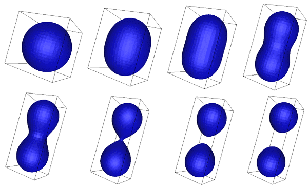

# Lab 04 - Modelagem de Formas 2D

## Objetivos:

1. Entender as caracteríticas e formas de avaliação dos 2 principais paradigmas de modelagem de Formas em CG: **Implícito** e **Paramétrico**;
2. Aprofundar o conceito e uso de *shaders* no contexto do *Three.JS*;
3. Reforçar os conceitos de modelos de representação de cores;
4. Identificar quando aplicar um ou outro modelo de cor, em função dos requisitos do problema. 

## Exercício:

A partir da analise o código do exemplo *1-formaParametrica-Bezier*, faça:

1. Leia com atenção o capítulo "*Curves*" em **[1]**, escrito por *Michael Gleicher*, em especial as seções 15.1 e 15.6.1. Considere a representação matricial de uma curva de Bezier apresentada nessa ultima seção. Implemente uma função que utilizando essa representação construa a curva de Bezier gerada pelo objeto *CubicBezierCurve3*.

2. Modifique sua aplicação para fazer com que a curva fique "animada", ou seja, seus pontos de controle mudem de posição ao longo do tempo. Implemente algumas variantes como: i) apenas os pontos de controle "internos" se movam; ii) apenas os pontos extremos se movam; iii) todos os pontos se movam. 

3. Crie uma versão da curva que mude de cor durante a animação. Por exemplo, a curva começa branca e se torna vermelha, depois azul, amarela,... ao longo do tempo.

4. Crie uma segunda versão onde a curva já inicia multicolorida, com o padrão do arco-íris, e que ao longo do tempo esse padrão vá se modificando. Dica: a escolha adequada do sistema de cores pode facilitar esse processo. 

A partir da analise do código do exemplo *2-formaImplicita*, faça:

5. Leia com atenção o capítulo "*Implicit Modeling*" em [1], escrito por *Brian Wyvill*, em especial as seções 21.1 (até 21.1.2) e 21.2 (até a 21.3.3) para compreender melhor as questões teóricas da representação implícita de objetos. Ou consulte também [3].

6. Simule o processo mostrado na Figura 1, onde dois pontos induzem um objeto implícito gerado pela composição das funções implícitas de cada ponto. Use o modelo de Blinn (**Blobby**) [1] [2]. Modifique a posição relativa dos pontos para gerar as diferentes configurações (suas correspondentes 2D) mostradas na Figura 1.

*Figura 1 - Dois pontos induzindo uma superfície.*

8. Faça com que a localização dos pontos varie automáticamente ao longo do tempo, para produzir um resultado semelhante ao da Figura 2.

*Figura 2 - Luminária de Lava, onde bolhas coloridas se movem, se fundem e se separam dentro de um recipiente.*

## Referências: 

[1]		MARSCHNER, Steve; SHIRLEY, Peter. "**Fundamentals of Computer Graphics**". 5th Edition CRC Press, 2021.

[2] 	wikipedia, "**Bézier curve**". Disponível em: https://en.wikipedia.org/wiki/B%C3%A9zier_curve

[3] 	Bourke, P., "**Implicit surfaces - Also known as "Metaballs", "Blobbies", "Soft objects"**", 1997. Disponível em: http://paulbourke.net/geometry/implicitsurf/

