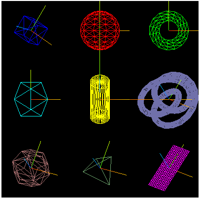
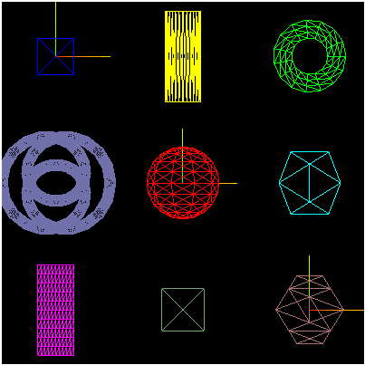

# Lab05 - Transformações Geométricas

## Objetivos:

1. Entender o conceito de transformações Geométricas;
2. Reforçar a importancia do uso da hierarquia na composição de cenários e objetos;
3. Aplicar transformações geométricas para a geração de animações simples;
4. Aprofundar o entendimento do processo de composição de transformações geométricas.

## Exercícios:

1. Analise com cuidado o código do exemplo "*Espaço do Objeto*". Entenda como os diversos objetos são criados e o resultado visual gerado. Atente para o fato de que todos os objetos estão em suas posições originais de criação, ou seja, no **Espaço do Objeto**. 
Por que eixos de referencia estão sendo criados a adicionados aos objetos e não a cena?

2. Consulte a documentação do *Three.JS* e verifique quais propriedades de *Object3D* são relativas as transformações geométricas de posicionamento, dimensão e orientação. 
A partir da sua identificação tente modificar os objetos do exemplo *Espaço do Mundo* para que os objetos fique organizados da forma como mostra a Figura 1.

*Figura 1 - Objetos organizados na cena.*

3. Adicione ao código do exercício 2 a possibilidade dos objetos girarem ao redor da origem da cena. Escolha um dos eixos coordenados como referência. 

4. Modifique novamente o código do exercício 2 para que cada objeto faça uma rotação própria, independente dos demais, ao redor de um eixo do seu sistema de referência.  

5. Pesquise na documentação do *Three.JS* sobre como agrupamentos de objetos podem ser criados. Uma vez entendido o funcionamento, crie 3 agrupamentos de objetos tal como a figura 2 ilustra. Repare que agora os eixos de referencia são utilizados para demarcar o referencial de cada agrupamento. A seguir aplique rotações em torno do eixo Y em cada agrupamento. 

*Figura 2 - Organização agrupada dos objetos da Figura 1.*

6. Analise o código do exemplo "*Composição de Transformações*". Nesse exemplo são criados 2 grupos de objetos: o primeiro onde as transformações são definidas através das propriedades do objeto, e o segundo onde as matrizes de transformações são geradas e aplicadas manualmente. 

Repare que, no primeiro grupo, independente da ordem em que as propriedades são definidas, sua ordem de aplicação é sempre a mesma. 

Acrescente ao segundo grupo o mesmo conjunto de primitivas do primeiro grupo, porém configurando manualmente a definição das matrizes de transformações, respeitando a ordem de aplicação estabelecida no primeiro grupo. 

O que acontece agora com os 3 objetos?

## Referências:

- MARSCHNER, Steve; SHIRLEY, Peter. "**Fundamentals of Computer Graphics**". 5th Edition CRC Press, 2021.

- Dirksen, J., **Learn Three.JS: Program 3D animations and visualizations for the web with JavaScript and WebGL**. 4th Edition, Packt Publishing, 2023.

- https://threejs.org/docs/index.html

- https://www.npmjs.com/package/lil-gui
