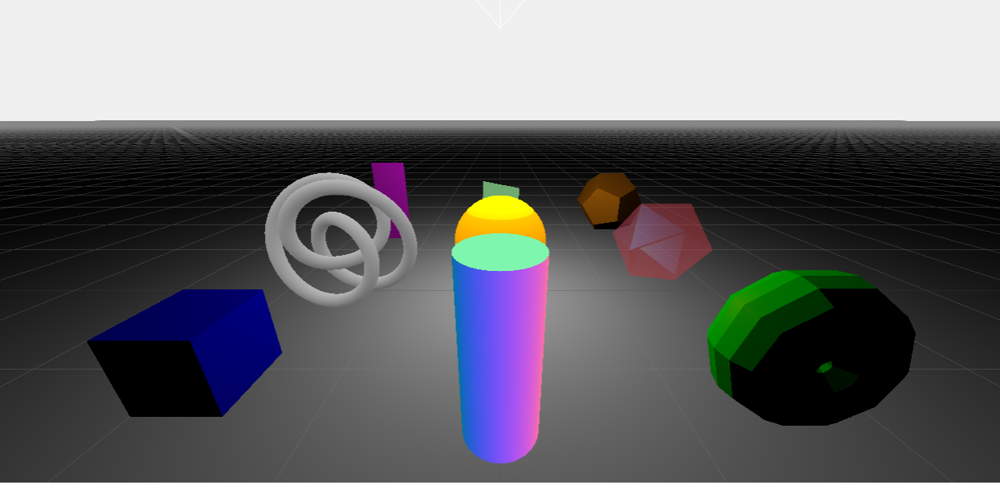
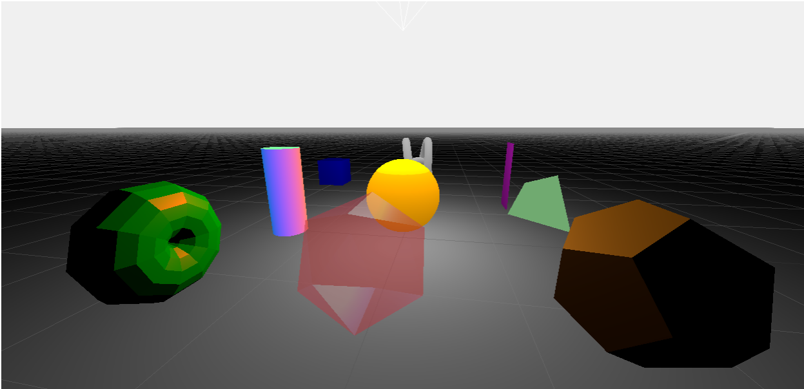
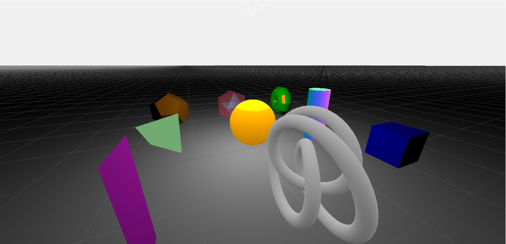
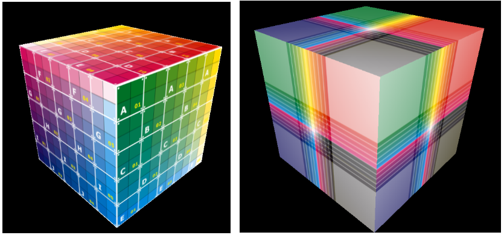
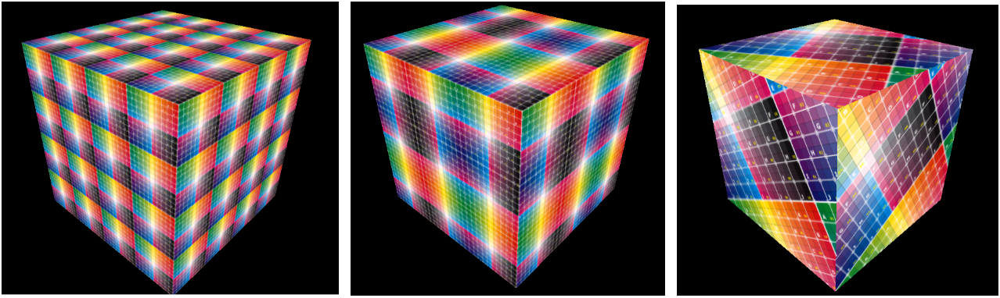

# Lab 10 - Luz, Material e Texturas

## Objetivos:

1. Entender como os diferentes tipos de fontes de luz modificam a renderização de cenas 3D;
2. Compreender como os modelos de iluminação loacis são implementados através de materiais dentro do *framework Three.js*;
3. Integrar os conceitos relacionados aos modelos de iluminação local no processo de renderização do *Three.js*.
4. Compreender o conceito de mapeamento de texturas e suas aplicações para obter efeitos realistas na renderização de objetos;
5. Integrar o mapeamento de textura dentro do processo de renderização do *Three.js*.

# Exercícios:

1. Altere o exemplo *01-luzes* para incluir outros tipos de fontes de luz suportados pelo *Three.js*, como:

* *HemisphereLight*
* *RectAreaLight*

2. Modifique o exemplo *02-materiais* para que cada elemento da cena possua a aparência das imagens a seguir:

 
 
 

3. Analise com cuidade o código do exemplo "*01-coordTextura*" e o modelo *.obj* que é carregado em seu código. Na Figura abaixo são feitas mudanças nas coordenadas de textura do modelo ou nos parâmetros de mapeamento para alcanças os resultados mostrados. Avalie qual o caso de cada imagem e proceda as mudanças necessárias. 

   

## Referências:

[1] MARSCHNER, Steve; SHIRLEY, Peter. "**Fundamentals of Computer Graphics**". 5th Edition CRC Press, 2021.

[2] Dirksen, J., **Learn Three.JS: Program 3D animations and visualizations for the web with JavaScript and WebGL**. 4th Edition, Packt Publishing, 2023.

[3] Three.js Docs, https://threejs.org/docs/index.html
